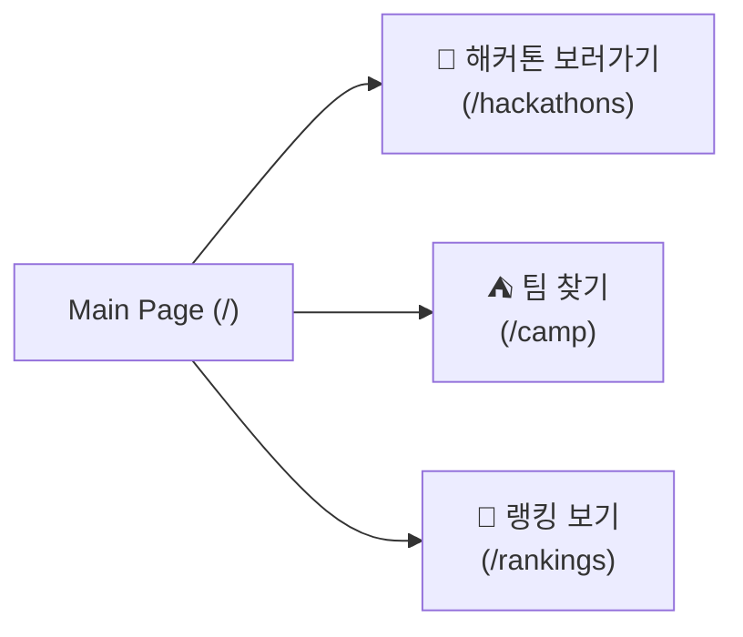

# 🏆 2026 해커톤 플랫폼 기획 명세서

본 문서는 해커톤 운영 및 팀 빌딩을 위한 플랫폼의 핵심 기능과 정책을 정의합니다.

---

## 🧭 글로벌 기능 (Global Features)

### 1. 네비게이션 바 (GNB)
서비스 전반에 걸쳐 접근 가능한 메뉴 구성을 제공합니다.
- 메인 (Home): `/`
- 해커톤 (Hackathons): `/hackathons`
- 팀 모집 (Camp): `/camp`
- 랭킹 (Rankings): `/rankings`

### 2. 공통 상태 피드백 (State Feedback)
모든 데이터 연동 화면에서 다음 3가지 케이스에 대한 UI 대응을 포함합니다.
- ⏳ Loading: 데이터 로딩 중 (스켈레톤 또는 스피너)
- 📭 Empty: 표시할 데이터가 없는 경우
- ⚠️ Error: 데이터 요청 실패 및 에러 발생 시

---

## 🏠 1. 메인 페이지 (`/`)

핵심 서비스로의 빠른 이동을 위한 3개의 대형 카드 버튼을 배치합니다.

---

## 🚀 2. 해커톤 목록 (`/hackathons`)

전체 해커톤 리스트를 탐색하는 페이지입니다.
- 리스트 카드 구성:
    - 제목, 진행 상태 (진행 중 / 종료)
    - 태그 (기술 스택, 분야 등)
    - 일정 (시작일 ~ 종료일)
    - 참가자 수 정보
- 상세 이동: 카드 클릭 시 `/hackathons/:slug` 경로로 이동
- 필터 기능: 진행 상태(Status) 및 태그(Tag)별 필터링 지원

---

## 📝 3. 해커톤 상세 (`/hackathons/:slug`)

해커톤의 모든 상세 정보를 담고 있는 7대 필수 섹션으로 구성됩니다.

| 섹션 | 설명 |
| :--- | :--- |
| 개요 (Overview) | 해커톤 안내 및 주최측 상세 정보 |
| 평가 (Eval) | 평가 기준 및 심사항목 정보 |
| 일정 (Schedule) | 전체 타임라인 (접수, 개발, 심사, 발표) |
| 상금 (Prize) | 시상 내역 및 참가 혜택 |
| 팀 (Teams) | 해커톤 내 팀 구성 및 초대/수락/거절 관리 (유의사항 팝업 포함) |
| 제출 (Submit) | 제출 가이드 및 폼 제공 (메모, 파일 - zip, pdf, csv 등 지원) |
| 리더보드 (Leaderboard) | 투표/평가 결과에 따른 순위 표시 (미제출자는 별도 표기) |

---

## ⛺ 4. 팀원 모집 (`/camp`)

해커톤과 독립적으로 또는 특정 해커톤을 위해 팀을 구성하는 공간입니다.

- 독립적 모집: 해커톤과 연결되지 않은 일반 프로젝트 팀 모집 가능
- 필터 기능: `/camp?hackathon=slug` 쿼리 스트링을 통해 특정 해커톤 전용 팀 조회 지원
- 모집글 구성:
    - 필수: 팀명, 팀 소개
    - 상태: 모집 중 여부 (`isOpen`)
    - 역할: 모집 대상 포지션 (`looking-for[]`)
    - 연락처: 링크 기반 (`contact.url`)
- 추가 옵션:
    - 실시간 채팅/쪽지 기능
    - 모집글 수정 및 마감(Close) 처리 기능

---

## 🥇 5. 랭킹 (`/rankings`)

해커톤 역사를 종합한 글로벌 유저 데이터 대시보드입니다.

- 데이터 테이블 항목:
    - 순위 (Rank)
    - 유저 닉네임 (Nickname)
    - 포인트 (Points)
- 필터 (Timeframe):
    - 최근 7일
    - 최근 30일
    - 전체 기간

---

## 🔒 보안 및 데이터 보호 정책

> [!WARNING]
> 다음 정보는 플랫폼 내에서 엄격히 보호되며, 외부 또는 일반 유저에게 공개되지 않아야 합니다.

1. 개인 정보: 내부 유저 정보 및 유저가 비공개(Private)로 설정한 프로필 데이터
2. 팀 내부 정보: 타 팀의 진행 상황, 소스코드, 제출물 등 핵심 기밀
3. 관리자 데이터: 시스템 운영을 위한 기타 관리자 전용 정보

---

*본 문서는 2026 해커톤 플랫폼의 표준 사양으로 사용됩니다.*
